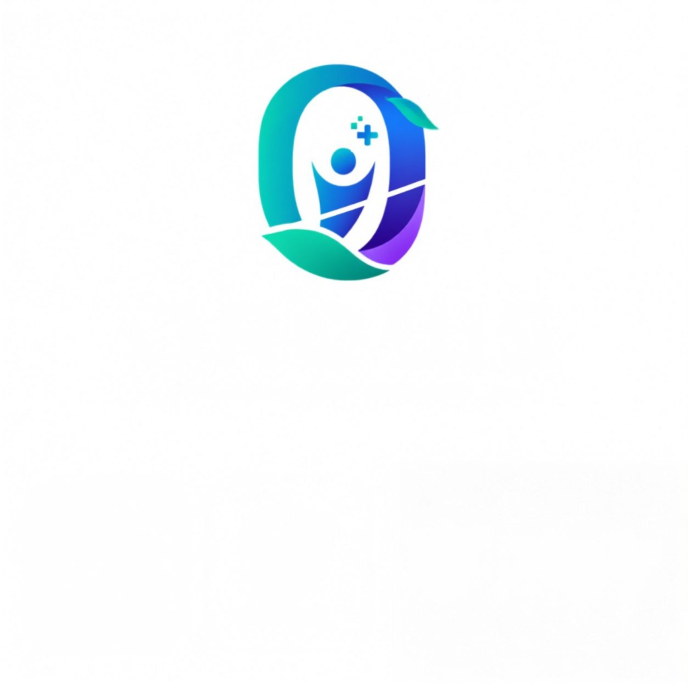

# Orqis — AI & Quantum-Enhanced Oral Screening Research

<p align="center">
  
</p>

<p align="center">
  <a href="https://nextjs.org/"></a>
  <a href="https://www.typescriptlang.org/"></a>
  <a href="https://tailwindcss.com/"></a>
  <a href="#"></a>
  <a href="#"></a>
</p>

A minimal, human-centered, and clinically inspired static showcase platform for the **Orqis** project. Orqis investigates the union of accessible mobile imaging, classical convolutional feature extraction (MobileNetV3 512D), and Variational Quantum Classifiers (VQC on Qiskit Aer) for frontline oral cancer preliminary triage.

---

## 🌟 Key Features

- **Clinical Clarity & Aesthetics**: Spacious layout, calm hierarchy, and organic curved transitions inspired by modern healthcare design and the official Orqis visual identity.
- **Dynamic Abstract Visuals**: Original medical imaging and quantum orbital visualization (`QuantumOrb.tsx`).
- **Interactive 8-Qubit VQC Circuit Visualizer**: Click-to-inspect schematic detailing amplitude state preparation, parameterized $R_y/R_z$ rotations, CNOT cascades, and Pauli-$Z$ readout measurements.
- **Client-Side Conceptual Sandbox**: Interactive risk calculator demonstrating multi-modal feature fusion (lesion embeddings + tobacco, alcohol, and betel quid lifestyle vectors) with live **HL7 FHIR R4 JSON** observation previews.
- **Strict Standalone Architecture**: Zero external backend dependencies or real patient data requirements.

---

## 🚀 Getting Started

### Prerequisites

- **Node.js**: v18.0 or higher
- **npm**: v9.0 or higher

### Installation

1. Clone the repository:
   ```bash
   git clone https://github.com/prajjwal-patel/orqis-website.git
   cd orqis-website
   ```

2. Install dependencies:
   ```bash
   npm install
   ```

3. Launch the local development server:
   ```bash
   npm run dev
   ```

4. Open your browser and navigate to:
   ```
   http://localhost:3000
   ```

---

## 🏗️ Project Structure

```
website/
├── public/
│   └── orqis-logo.png         # Official Orqis project logo
├── src/
│   ├── app/
│   │   ├── layout.tsx         # Root layout with clinical SEO metadata
│   │   ├── page.tsx           # Single-page experience with all 10 sections
│   │   └── globals.css        # Tailwind v4 theme, organic curves & glassmorphism
│   ├── components/
│   │   ├── layout/
│   │   │   ├── Navbar.tsx     # Floating glass navbar with Orqis logo & mobile drawer
│   │   │   └── Footer.tsx     # Clinical disclaimer, standards & sitemap
│   │   ├── sections/
│   │   │   ├── HeroSection.tsx
│   │   │   ├── PurposeSection.tsx
│   │   │   ├── HowItWorks.tsx
│   │   │   ├── TechnologyStack.tsx
│   │   │   ├── QuantumMLSection.tsx
│   │   │   ├── InteractiveDemo.tsx
│   │   │   ├── PhilosophySection.tsx
│   │   │   ├── TimelineSection.tsx
│   │   │   └── TeamSection.tsx
│   │   ├── ui/
│   │   │   ├── Badge.tsx
│   │   │   ├── Button.tsx
│   │   │   ├── Card.tsx
│   │   │   └── SectionHeader.tsx
│   │   └── visual/
│   │       ├── CircuitDiagram.tsx
│   │       ├── QuantumOrb.tsx
│   │       └── OrganicDivider.tsx
│   ├── lib/
│   │   ├── constants.ts       # Terminology, milestones, and copy
│   │   └── mockData.ts        # Client-side deterministic simulation logic
│   └── types/
│       └── index.ts           # TypeScript interfaces
├── package.json
└── tsconfig.json
```

---

## 🔒 Disclaimer

Orqis is an investigational research initiative and clinical decision support demonstration. It does not provide definitive medical diagnoses or replace histopathological examination by certified healthcare specialists.

---

## 📄 License

MIT License. Open-access scientific research and demonstration.
